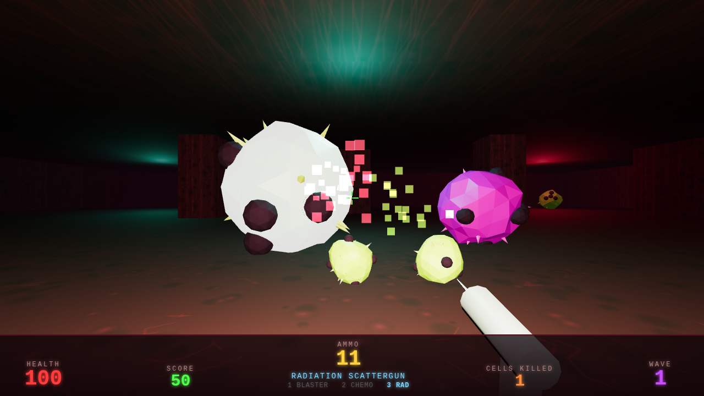
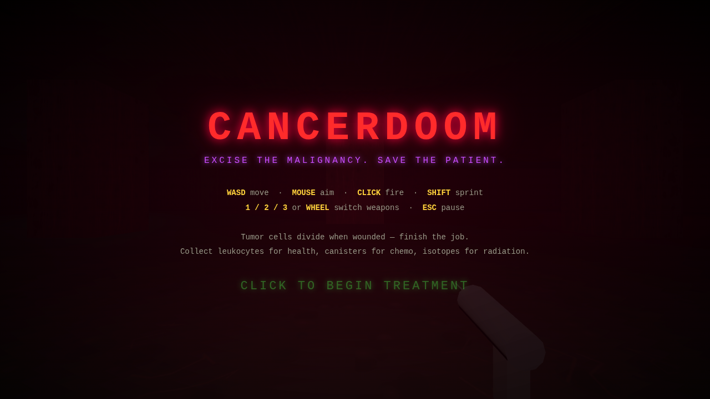

# CANCERDOOM

A Doom-style first-person arena shooter set inside the human body. Waves of
malignant cells are proliferating — excise them before the patient is lost.



## Play

It's a static web app (Three.js, no build step). Serve the folder and open it
in a browser:

```bash
# any static server works
python3 -m http.server 8000
# or
npx serve
```

Then visit `http://localhost:8000` and click to begin treatment.

Three.js is vendored in `lib/`, so it works fully offline.

## Controls

| Input | Action |
|---|---|
| Mouse | Aim |
| Click (hold) | Fire |
| `W A S D` / arrows | Move |
| `Shift` | Sprint |
| `1` / `2` / `3` or wheel | Switch weapon |
| `Esc` | Pause |

## Arsenal

- **Antibody Blaster** — precise, infinite ammo, your fallback.
- **Chemo Chaingun** — shreds at close range, burns through chemo canisters.
- **Radiation Scattergun** — 8 pellets of isotope per blast, devastating up close.

## The malignancy

- **Carcinoma cells** come in three sizes. Larger cells *divide when destroyed* —
  mitosis splits them into two smaller, faster cells. Finish the lineage.
- **Metastatic spitters** (magenta) keep their distance and lob corrosive
  projectiles. Prioritize them.
- Destroyed cells sometimes drop **leukocytes** (+25 health), **chemo
  canisters** (+40 chemo), or **isotopes** (+6 scattergun shells).

Waves scale forever. There is no cure — only a high score.



## Tech

- Three.js r160, vanilla ES modules, zero dependencies and zero build step.
- All textures are generated procedurally on `<canvas>` (flesh walls,
  capillary floors); all sound is synthesized with the Web Audio API.
- Enemies are displaced icosahedra with spike/lesion decorations, lit by
  ACES-toned point lights and volumetric-ish exponential fog.
